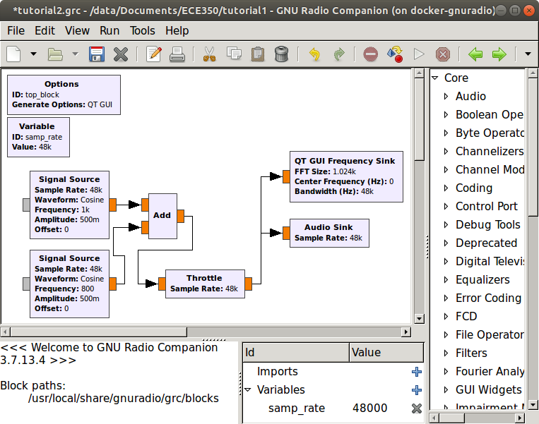
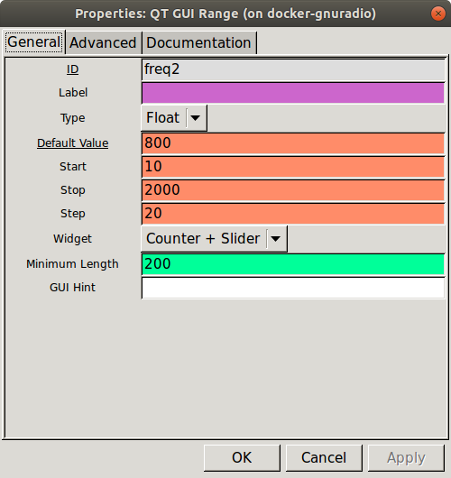
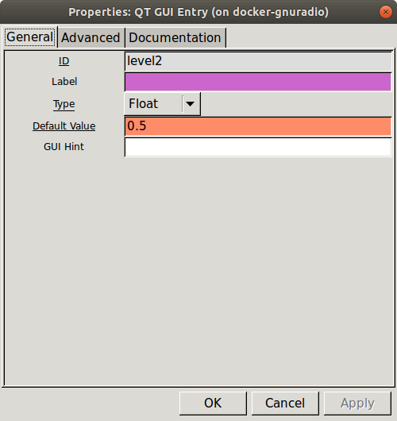
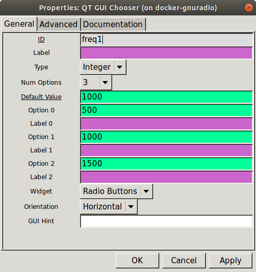

## Objectives

This tutorial illustrates some of the features available in GNU Radio Companion when using QT GUI, such as sliders and other variable input options. It is valuable to keep in mind while working through this material that the visual flow graph is just a wrapper for the underlying python code, and that the choosers and sliders represent variables in the code.

In this tutorial you will learn how to:

- add GUI controls such as sliders and radio buttons to your flowgraph.
- use variables to connect controls to different flowgraph parameters.

## Working with Sliders

- Launch GRC as done in the previous tutorial. If GRC is already open, simply create a new flowgraph by selecting File->New.

- Construct the flow graph shown. Note that the sample rate is set to 48000 in this example.

     
    __*Simple flow graph with two inputs and two outputs.*__

- Execute the flow graph. You should hear the composite tone and see the FFT sink display of the spectrum. Experiment with the FFT size in the FFT sink. It should be a power of two. Note that as you increase the FFT size the resolution of the display increases. Reset the FFT size to 1024 when you are done.

- Add a *QT GUI Range* (from the *GUI Widgets->QT* category) to the flow graph. Double-click on the block and set the parameters as shown.

     
    __*GUI slider properties dialog.*__

- The ID box is the name of the variable that will be used to assign control. The Label box is optional. If filled, it will be used as a label for the controller in the output display.

- Execute the flow graph. This time when the FFT sink display opens you will see a horizontal slider at the top. Move the slider back and forth to change the value of freq2 between 10 and 2000. You should observe that this does not change the spectrum or the sound. This is because freq2 has not been assigned to control anything.

- Double-click on the bottom *Signal Source* (the one set to 800 Hz). Replace the frequency (800) with `freq2`. Execute the flow graph. You should now observe that both the spectrum and the sound change as you vary the frequency of the Signal Source using the slider.

## Working with Text Boxes

- Add a *QT GUI Entry* to the flow graph (*GUI Widgets->QT* category). Set the parameters shown below.

     
    __*GUI entry properties dialog.*__

- Double-click on the bottom Signal Source and replace the Amplitude (0.5) with the variable, `level2`. Execute the flow graph. Note that a text box will now appear in the display. The default value of 0.5 will be entered. Change the value to 0.1 followed by Enter. The volume of the 800 Hz tone will decrease and this will be reflected on the spectrum plot. **Do not vary the level above 1.0**.

## Working with Choosers

- Add a *QT GUI Chooser* block to the flow graph. This block will add either a combo box or radio buttons. Input the below parameters.

     
    __*GUI chooser properties dialog.*__

- Change the Frequency of the top Signal Source (1 kHz) to `freq1`. Execute the flow graph and change the frequency of the top Signal Source using the radio buttons. Experiment with the other QT GUI widgets to see how they work.

## Working with Notebooks

- Add a *QT GUI Tab Widget* block to the flow graph. This control allows you to arrange large GUI components (scope, FFT, waterfall, etc) into a tabbed notebook. Set the properties as:
  
  - *ID* to "tabs_0"
  - *Num Tabs* to 2
  - *Label 0* to "Scope"
  - *Label 1* to "Spectrum"

- Add a *QT GUI Time Sink* to the flowgraph and connect it to the output of the *Throttle* block. Double click this block and set the *Type* to *Float* and set the *GUI Hint* to "tabs_0@0", where "tabs_0" indicates the tab widget where you would like the element to appear and the 0 after the @ indicates the list index of the label you would like it to appear under. In this case, 0 points to the list index of 'Scope'. Close the properties dialog.

- Double click the *QT GUI Frequency Sink* to open the properties dialog. Set the *GUI Hint* to "tabs_0@1". The 1 points to the list index of 'Spectrum' that was configured in the *Labels* field of the tabs widget. Close the properties dialog.

- Execute the flowgraph. The scope and FFT views should now be visible on separate tabs labeled "Scope" and "Spectrum" respectively.
  


## Conclusions

In this tutorial you have learned how to add GUI controls to your flowgraph and how to use them to control different parameters of the flowgraph. These skills will be useful when creating a tunable AM receiver in the next tutorial. When you feel comfortable with this material, please feel free to move on to Tutorial 3.
