<!-- [**Back to Part 1**](USRP-IQ.md) | [**Continue to conclusion**](conclusion.md) -->

## Objectives

This tutorial is a guide to receiving SSB signals. It will also illustrate some of the properties of complex (analytic) signals and show why we use them in communications systems. In this tutorial you will:

- Use a frequency-translating filter to perform filtering and tuning in one step.
- Construct an SSB demodulator using Weaver's Method.

---

## Part 2 Deliverables

- Two GRC files of SSB demodulators. You will be stepped through building them.
- There is 1 question in this part. It is clearly indicated.
  - The question requires approximately 1 line of writing, and addresses a concept, not details. Answer the question and submit a single page containing the answers to your TA at the end of the lab.

---

## Complex/Analytic Signals

- Review the [theory of analytic signals and SSB receivers](../../_docs/pdriessen_textbook.pdf) (sections 2.3 and 3.4).

### Complex multiplication

- Create the a new flow graph as shown below. Make sure that all of the blocks are of type *Float*. This flow graph takes two sinusoids, at frequencies of 1 kHz and 10 kHz and multiplies them together. Using a trigonometric identity we know that the product of two cosines gives two cosines at the sum and difference frequencies of the original signals. In this case we expect outputs at 9 kHz (difference) and 11 kHz (sum).

  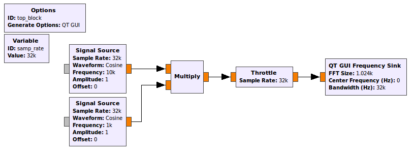 
  __*Flow graph with two multiplied sinusoidal inputs.*__

- Execute the flow graph and confirm this result. Note that the FFT plot shows both the positive and negative frequencies. We know that for real inputs the negative frequency components are the same as positive frequency components. Hover your mouse over the peaks to see that the frequencies are as expected (9 kHz and 11 kHz).

- Change ALL of the blocks to Type: *Complex* and execute the flow graph again. You should now observe a single output at 11 kHz. This is the original 10 kHz signal shifted by the 1 kHz signal. If we want to shift in the negative direction a frequency of -1000 can be used. Try this. From this example we see two of the primary advantages of using analytic signals. A signal can be shifted (sum) without creating an additional difference signal. Also, note that there are NO negative frequency components. **Why is this?**

- Remember what a complex signal looks like in the time domain, you will need to know this later in the lab.

- You can discard this flowgraph, it is not a deliverable.

## Single Sideband (SSB) DAT file Weaver demodulator

In this section you will learn one technique for demodulating Single Sideband Signals. Section 2.3.7 of [the textbook](../../_docs/pdriessen_textbook.pdf) shows the following images as illustrations of this technique. Familiarize yourself with them and their mathematical descriptions, you're going to build them!

   
  __*Block diagram for a real Weaver demodulator*__

   
  __*Block diagram for a complex Weaver demodulator*__

- Notice how many fewer blocks are needed for the system when using complex signals.

### Streaming the complex baseband data

- Download [this data file](data/ssb_lsb_256k_complex2.dat).

  - This data file was recorded by a USRP set to a center frequency of
50.3 MHz with a sample rate of 256 kHz.

- Create a new flow graph as shown below.
  - The *File Source* should be set to the data file that you just downloaded.
  - The *Variable* block which sets the sampling rate variable (`samp_rate`) should be set to 256000 as this is the data rate that the received signal was sampled at.
  - In the "Config" tab of the *QT GUI Frequency Sink*, set "Control Panel" to *Yes*.

   
  __*Flow graph with a file source input.*__

- This flowgraph will be your first deliverable. Save it as `SSB_DAT_demodulator.grc`, and in the *Options* block, set the following:

  - **Title:** SSB DAT Demodulator
  - **Author:** V00xxxxxx, V00yyyyyy (where all of your student numbers are included)

- Execute the flow graph. After the spectrum appears, adjust the *Ref Level*  and *Y Range* parameters so that the amplitude values range from -20 dB to 80 dB. You should view a section of the spectrum that is 256 kHz wide (due to the sample rate). Note that there is one signal visible between 40 and 60 kHz.

- When this signal was recorded, the USRP was set to a frequency of 50.3 MHz. Thus, the 0 kHz point on the display corresponds to 50.3 MHz.
  - While the FFT Plot is displayed move the cursor over the signal and note the frequency along its right edge. It should be approximately 53 kHz. Since this is a lower sideband (LSB) signal, this corresponds to the carrier frequency. Because the "zero" frequency corresponds to 50.3 MHz, the original carrier frequency of signal was 50.3 MHz + 53 kHz = 50.353 MHz. However, now that the spectrum has been shifted down by 50.3 MHz, we use the carrier frequency of 53 kHz.
  - The bandwidth of this LSB signal is 3 kHz.

### First frequency shift and LPF using a single GRC block

The first step in building a receiver is to use a channel filter to pass the signal of interest and filter out the rest of the signals in the band. This is done as follows:

  1. First the signal of interest is shifted down to zero frequency as shown below.

        
       __*Signal shifting*__

  2. Next a low pass filter is applied so that the other signals will be filtered out as shown below.

        
       __*Signal shifting with a filter*__

When using real signals, this first shift and low-pass filtering involves all of the highlighted blocks in the diagram below.

  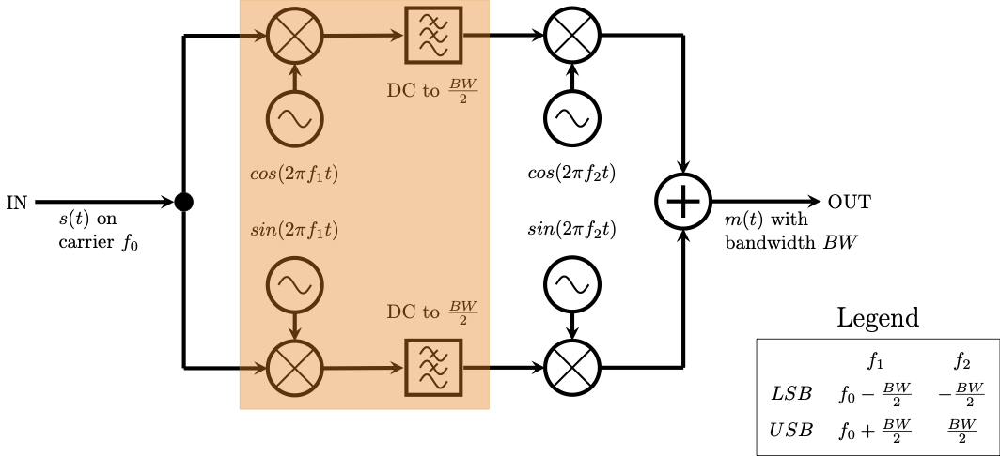 
  __*Signal shifting with a filter in the real domain*__

This is far simpler when operating in the complex domain, as illustrated by the *equivalent circuit* below.

  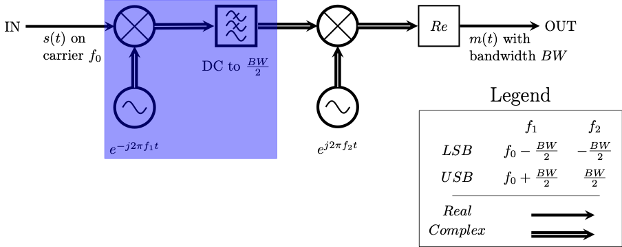 
  __*Signal shifting with a filter in the complex domain*__

- In GRC, the *Frequency Xlating FIR Filter* performs both of these operations (the frequency shift down to zero, as well as the low pass filter).

  - [Follow this link on the Frequency Xlating FIR Filter block](https://wiki.gnuradio.org/index.php/Frequency_Xlating_FIR_Filter) to review what the block is doing.
    - The frequency shift of ***s(t)*** down to 0 is done by generating a complex exponential at ***f0 + f1*** and multiplying it by ***s(t)***.

  - Add the block between the *File Source* and the *Throttle*.

  - Complete the properties window as shown below. The center frequency of 51500 will shift the entire spectrum down by 51500 Hz.
  > Note: The function indicated in the *Taps* parameter generates the taps for a low pass filter with a gain of 1 (in the pass band), a sampling rate equal to `samp_rate` (256 kHz), a cutoff frequency of 2 kHz and a transition width of 100 Hz.

   
  __*Frequency Xlating FIR Filter properties dialog.*__

- Execute the flow graph. You will see that your signal has now moved down to the origin and is the only signal present as in the figure below.

  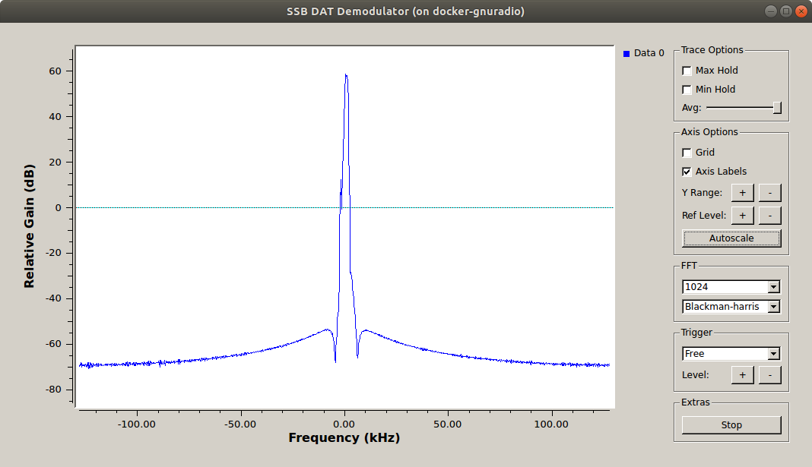 
  __*Filtered SSB spectra*__

- Add a *Variable* block with:
  - ID: *decim*
  - Value: 4

- After the LPF the bandwidth of the signal is reduced, thus we can reduce the sampling rate to minimize computation time by decimating.

  - Re-open the *Frequency Xlating FIR Filter* block
    - Change the *Decimation* parameter to `decim`
    - Change the taps to `firdes.low_pass(1,samp_rate/decim, 2000, 100)`
  - This will reduce the sample rate to **256000/4 = 64000 Hz**. Change the sample rate of the *Throttle* and *QT GUI Frequency Sink* to this new rate, using the `decim` variable. **What frequency range to you expect the FFT to display now?**

- Execute the flow graph again to see if you are correct. You should now observe an expanded version of your signal as in the figure below. Select *Autoscale* on the frequency plot so that the peaks of the signal are observed. Notice that after a while, the signal level will be reduced for a few seconds. That occurs when the station stops transmitting.

  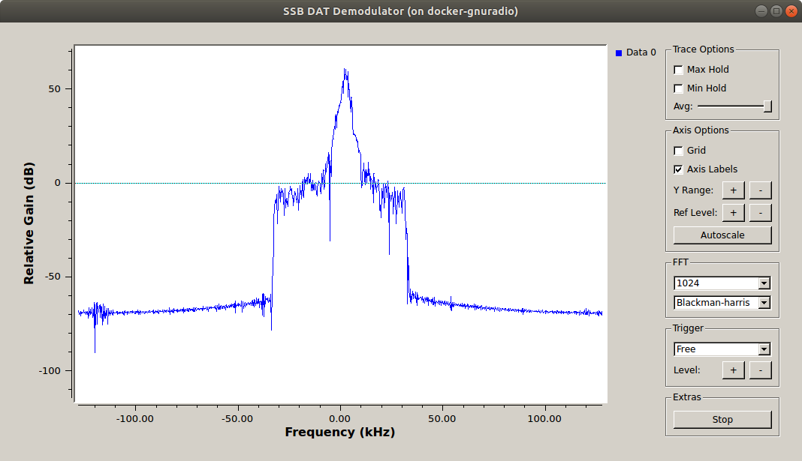 
  __*Filtered and decimated SSB spectra*__

#### Using the firdes module

In the previous step, we used the firdes module of GNU Radio. For more information on this tool, [check out the documentation](https://www.gnuradio.org/doc/doxygen/classgr_1_1filter_1_1firdes.html#details).

This module is used for generating finite impulse response (FIR) filters in GNU Radio. There are a number of filters available that can be explored in the API Reference link above. Some of the commonly used filters are listed below. The basic usage format is
`firdes.filter_type(args)` where `filter_type(args)` is one of:

- `band_pass(gain, sampling_freq, low_cutoff_freq, high_cutoff_freq, transition_width)`

- `band_reject(gain, sampling_freq, low_cutoff_freq, high_cutoff_freq, transition_width)`

- `complex_band_pass(gain, sampling_freq, low_cutoff_freq, high_cutoff_freq, transition_width)`

- `high_pass(gain, sampling_freq, cutoff_freq, transition_width)`

- `low_pass(gain, sampling_freq, cutoff_freq, transition_width)`

This list indicates the minimum number of arguments required for the filter to be generated. Each filter can also take an argument for the **type of window** it uses and the **beta value**. Additionally, each of these filter types has a "_2" version (ie: `band_pass_2`, `low_pass_2`). These versions take an extra parameter which specifies the stop band attenuation in dB. It is worthwhile to familiarize yourself with the usage of this module as it will be used again in these labs.

### Second frequency shift

Recall the original block diagram of Weaver's SSB demodulator. The signal has been shifted down to zero, low-pass filtered, and decimated. Now the signal needs to be shifted off of zero. The highlighted portion of the block diagram below shows the real multiplication *as well as* the necessary addition of the I and Q streams.

  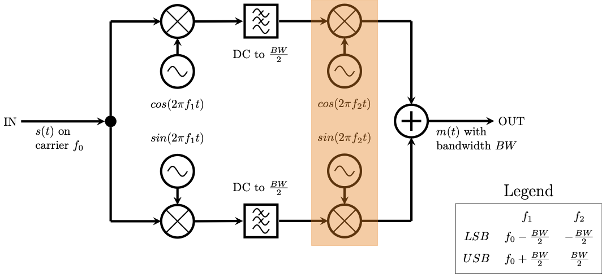 
  __*Second frequency shift in the real domain*__

Once again, this is simpler using complex signals. The highlighted portion of the block diagram below shows this.

  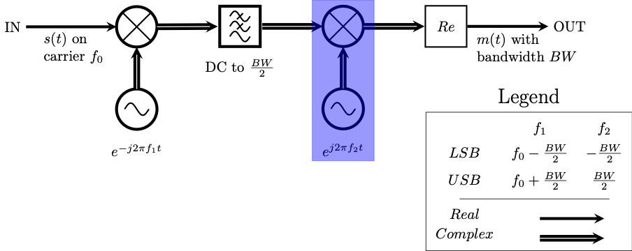 
  __*Second frequency shift in the complex domain*__

> Note that no addition is necessary, since the complex multiplication dealt with both the I and the Q streams.

- To do this on your flow graph, add a *Multiply* block as well as a *Signal Source* block. Ensure that the *Type* for both is *Complex*.
  - Remembering that the bandwidth for this signal is 3 kHz and we want to shift it off of 0 Hz. This means a shift of 1.5 kHz is necessary. This is a *Lower* Sideband signal (note that the block diagrams above are for *Upper* sideband demodulation), and so you want to shift the signal down by 1500 kHz. Knowing this, set the *Frequency* parameter of the *Signal Source* block appropriately.
  - *Sample Rate*: Remember the decimation factor. What is the sampling rate at this point in the flow graph? Change the *Sample Rate* parameter in the *Signal Source* block.

- Before executing the flowgraph, remember to change the *Bandwidth* property of the *QT GUI Frequency Sink* block to match the sampling rate at this point in the flowgraph. The flowgraph should now look like the following image.

  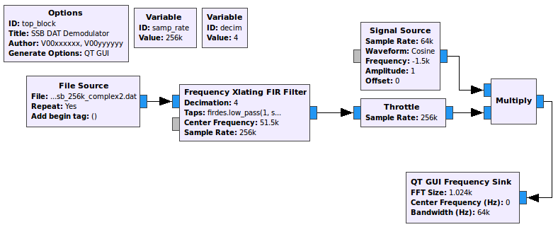 
  __*Flowgraph after first frequency shift*__

- Observe the spectrum to ensure that the signal shifted the correct direction. You can use your mouse cursor to see that the signal is centered at -1.5 kHz. Note that there is only one signal. If this had been done using real signals we would expect sum and difference frequencies as we saw earlier.

### Resampling for audio

- The sampling rate at the output of the complex multiply should be **`samp_rate`/`decim` = 64 kHz** which is not a standard audio rate. Use a *Rational Resampler* block to make the sampling rate **48 kHz**.
  - Use *Type*: *Complex->Complex (Complex Taps)*

- Remember from your AM demodulation experience that the volume needs to be normalized. To do this, use a *Multiply Const* block after the *Rational Resampler*. **How can you find the volume normalization constant?**

  - To normalize, every sample must be divided by the maximum value in the transmission. To find that value:

    - add a *QT GUI Time Sink* to the output of the *Rational Resampler* (before the *Multiply Const* block)
    - execute the flowgraph, and scale the plot appropriately
    - use your mouse cursor to identify the maximum amplitude of the transmission
    - enter the reciprocal of this value into the *Multiply Const* block

- Add an *Audio Sink* block with your chosen sample rate of 48 kHz to the output of the *Multiply Const* block. **Notice the red signal path!** The *Audio Sink* only accepts floats, and the entire flowgraph to this point is using complex signals. Use a *Complex To Real* block in between the *Multiply Const* and the *Audio Sink* blocks.

  > Considering the output of the *Multiply Const* block to be ***m(t)***, the *Complex To Real* block accepts ***m(t)*** as an argument and outputs ***Re{m(t)}***. This operation takes place in the highlighted region of the next two block diagram.

  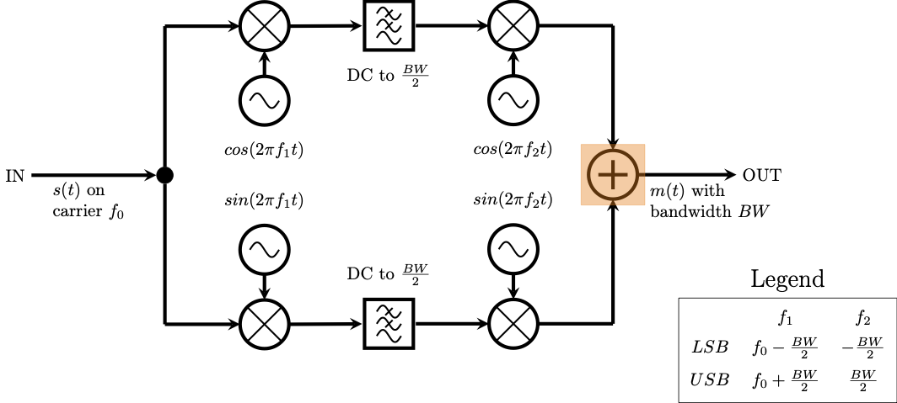 
  __*Taking the real part of the signal in the real domain*__

  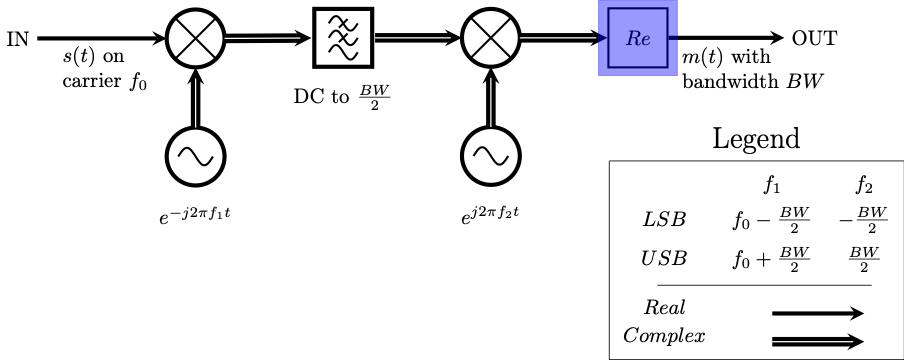 
  __*Taking the real part of the signal in the complex domain*__

- Execute the flowgraph to test your SSB receiver. You should now clearly hear a voice. Your flowgraph should look like the following figure.

   
  __*SSB complex flowgraph*__

### Taking the real part of a complex signal

Remember that taking the real part of the complex signal is the same thing as adding the negative frequencies! The last two block diagrams highlighted this. To check it yourself, add two *QT GUI Frequency Sinks*, one before and one after the *Complex To Real* block. Title them appropriately ("Complex (before)" and "Real (after)") and execute the flowgraph. It should look like the following image.

   
  __*SSB complex vs real spectra*__

---

#### Deliverable Question 4

Why does taking the *real* part of a complex signal result in frequencies being *added* to the spectrum?

---

- Save this flowgraph. It is a deliverable.

## Single Sideband (SSB) WAV file Weaver demodulator

The last demodulator you made was for LSB signals stored in a DAT file. You will now demodulate USB signals stored in a WAV file.

- Make a copy of `SSB_DAT_demodulator.grc` and name it `SSB_WAV_demodulator.grc`. You can do this by going ***File -> Save As*** in GRC.
  - In the *Options* block change the title to be "SSB WAV Demodulator".
  - This file will be your second deliverable.

- Change the *File Source* block to a *Wav File Source* block

- Download [this data file](./data/SDRSharp_20130920_3500kHz_IQ.wav) and point the *Wav File Source* block at it.

  - Modify the block properties as shown below.

    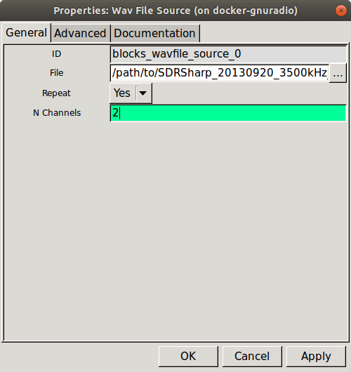 
    __*WAV File Source properties dialog.*__

  - This WAV file was recorded using the I and Q streams for the R and L channels. By setting the block to have two output channels you will be able to use the full I/Q signal.
    > Note that we normally would take I to be L and Q to be R, but in this case they are reversed.

  - Add a [Float To Complex](https://wiki.gnuradio.org/index.php/Float_To_Complex) block to convert from I and Q to a complex signal.

    - Cross the streams from the *Wav File Source* block into the *Float To Complex* block
  
       
      __*WAV file output streams*__

  - The WAV file was captured at 48 kHz so change `samp_rate` to 48 kHz
  - No decimation is necessary anymore, since we're already at a low sampling rate, so change `decim` to 1. **What decides whether a sampling rate is low?**
  - Because 48 kHz is a standard audio sampling rate, you can remove the *Rational Resampler* block as well.

- There are two SSB voice signals in this file, both are upper sideband (USB), whereas the first data file was lower sideband (LSB). The Weaver demodulator needs some small modification to work with USB.

  - The complex multiply was shifting the centered LSB signal **down** by 1.5 kHz. It now needs to shift the centered USB signal **up** by 1.5 kHz. Implement this.
    > Hint: Refer to [the diagram above](./figures/part1_weaver-real-block-diagram.png) illustrating the Weaver demodulator and now consider using the upper sideband. In the diagram, the first frequency shift is ***f0 +- B/2***, where LSB is the ***-*** and USB is the ***+***. There is a typo in the figure, and the second frequency shift should read ***+- B/2***, again with the ***-*** for LSB and the ***+*** for USB.

  - One of the center frequencies in this file is -3500 Hz. Adjust the *Frequency Xlating FIR Filter* block to this.
  - Use the *QT GUI Time Sink* block to find the maximum amplitude and adjust the volume controlling *Multiply Const* block as before.

- Your flowgraph should look like the following

    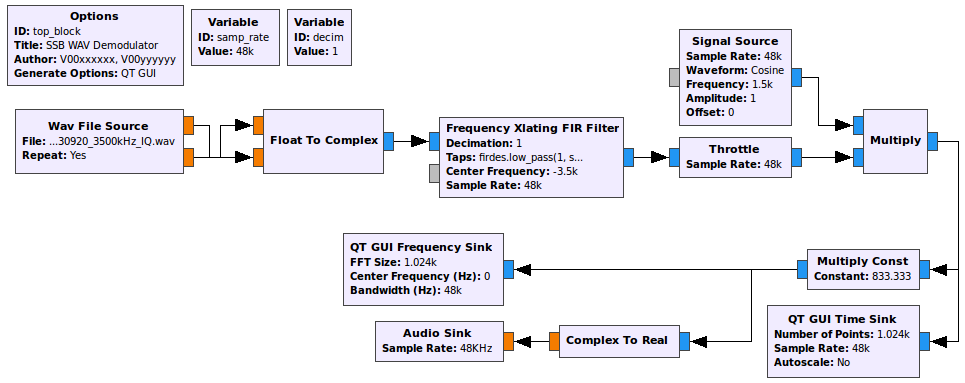 
    __*SSB demodulator for 48 kHz WAV file*__

- Execute the flowgraph and listen.
  - The voice is legible but noisy and you should hear static. Observe the spectrum and see that the signal is not occupying the entire 3 kHz bandwidth. This means that frequencies outside of the bandwidth are contributing to the audio.
  - Add a *QT GUI Range* block and give it the *ID*: `bandwidth`. It should default to 2000, have a minimum of 100, a maximum of 3000 and a step size of 100.
  - Edit the firdes filter in the *Xlating FIR Filter* block such that the cutoff frequency of the LFP uses the `bandwidth` variable.
  - Execute the flowgraph again and adjust the bandwidth "live" while observing the USB signal. **What bandwidth provides the clearest audio?**

**Listen to the spoken words in the transmission: which city is the transmission being made from?**

- Remembering that the file contains two USB transmissions, find the second one.
  - Add a *QT GUI Range* block to control the center frequency and try to find the other USB transmission captured in the file!
  - Having either a full bandwidth spectrum or waterfall plot will help with this. You should add the *QT GUI Sink* of your choice to the output of the *Float To Complex* block to avoid any filtering.
  - Execute the flowgraph, when you see the second signal, notice that it is much weaker. You will need to add a volume adjustment as well.

- The final flowgraph should look like the following figure.

    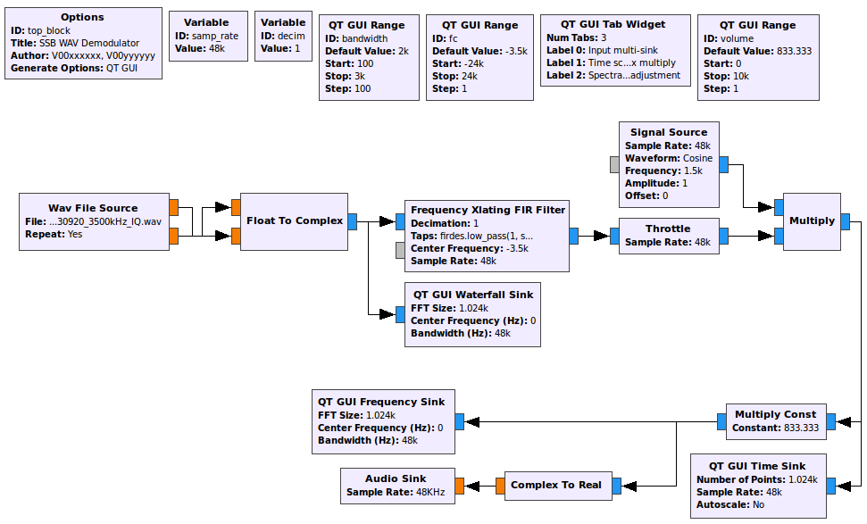 
    __*SSB demodulator for 48 kHz WAV file with controls for tuning*__

**As a challenge, identify the two callsigns spoken in the second transmission. Each callsign is two letters followed by one number and another two letters (ie. AB1CD)**

 > From a callsign you can locate the location of the station using [this database](https://www.qrz.com/).

- Save this file for submission.

## SSB signal demodulation using only real signals

Remember the two block diagrams at the start of building the SSB demodulators. One was for [real signals](./figures/part1_weaver-real-block-diagram.png), and one was for [complex signals](./figures/part1_weaver-complex-block-diagram.png). In this lab you built the far simpler and superior complex system. We will now quickly analyze the real diagram.

Download [this GRC file](./data/SSB_real_demodulator.grc). Open it and point the *File Source* block at `ssb_lsb_256k_complex2.dat`. Run the flowgraph, the audio should be the same as your first flowgraph. **Look through the flowgraph and identify the different key components: the first frequency shift, the LPF, and the second frequency shift.**

<!-- #TODO Remove at a future date or reintegrate -->
<!-- - A data file taken using a software receiver with a wire antenna about 6 meters above the ground is found [here](./data/SDRSharp_20130919_004154Z_14053kHz_IQ.wav).
  - Change the Wav File Source to read this file, and test your receiver using this file.
  - The file contains mostly Morse code signals, no voice signals. Replace the fixed offset of 1500 Hz with a variable and control it with a WX GUI Slider. **What happens when the slider is moved and why?**
  - Replace the fixed bandwidth of the firdes module with a variable and control it with a Slider. For receiving Morse code signals, a bandwidth of 50-200 Hz is best. -->

<!-- Save this flowgraph. You can modify it for use with the RTL-SDR receiver
and listen to live Morse code and SSB signals in the frequency range
24.9-25.0 MHz, 27-29 MHz, 50.0-50.2 MHz. These frequencies will
propagate over long distances via the ionosphere for some (not all) of
the time. Other frequencies are 144.0-144.3 MHz and 145.8-146.0 MHz. -->

---

At this point, you should have:

- two GRC files
  - `SSB_DAT_demodulator.grc`
  - `SSB_WAV_demodulator.grc`

## Deliverables

From this part of the lab keep the following files to submit to your TA after the second (and final) part:

- `SSB_DAT_demodulator.grc`
- `SSB_WAV_demodulator.grc`

- The answer to [Question 4](#deliverable-question-4)

**Do not attach the `top_block.py` files to your submission.**

<!-- ---
[**Back to Part 1**](USRP-IQ.md) | [**Continue to conclusion**](conclusion.md) -->
