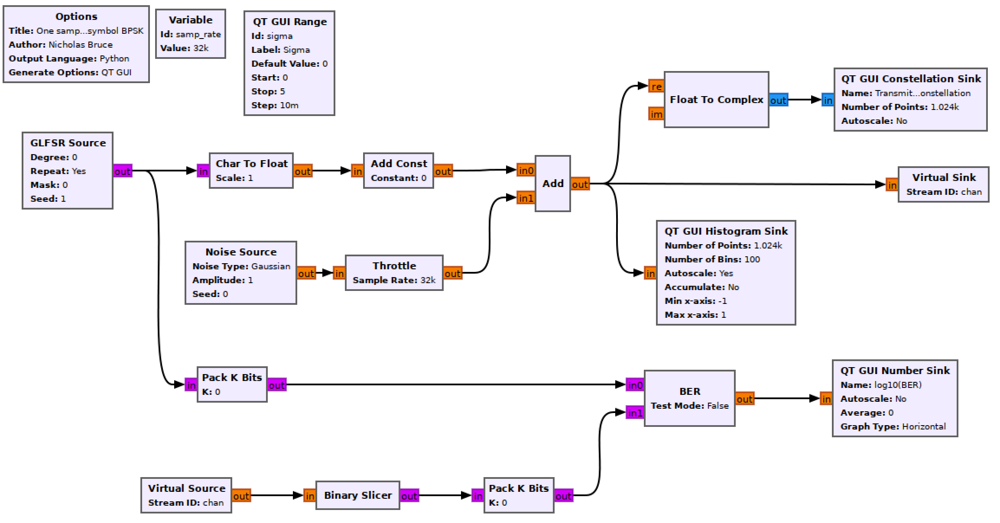

## Objectives

You will implement a communications system using baseband pulses and generate a histogram to visualize bit errors.

---

## Part 2 deliverables

For this section, the deliverables are:

- the answer to two deliverable questions,

---

## Building the flowgraph

Construct the following GRC flowgraph.

   
  __*Blank one sample per symbol baseband flowgraph*__

### GLFSR Source

This block outputs a pseudo-random bit stream using a shift register as described in the [theory section]({{ site.baseurl }}). Set the Degree of the shift register to 20 (this is the LFSR's $$M$$ value). Set it to repeat.

### Char To Float & Add Const

The output of the GLFSR block is a series of 1's and 0's. In order to build a bipolar communication system the 0s must become -1s. This can be done using the following equation

$$
y[n] = 2x[n]-1
$$

where $$y[n]$$ is the output stream made up of -1s and 1s and $$x[n]$$ is the input stream of 0s and 1s.

Set the *Scale* parameter of the *Char To Float* block to 0.5 (this will divide the input by the scaling factor) and the *Constant* parameter of the *Add Const* block to -1. You can observe the output of the *Add Const* block using a *QT GUI Constellation Sink* to see that this is now a bipolar signal.

### Noise Source

_Text section 3.1.3.4 and handwritten notes p. 37._ The noise power of pure White Gaussian noise is the variance of the distribution ($$\sigma^2$$) (text section 3.1.3.4).

The *Amplitude* variable sets the noise standard deviation, $$\sigma$$. This means you can directly control the noise power by setting this value.

Set the noise *Amplitude* to `sigma`.

### QT GUI Range

This will be used to control the noise power added to the bitstream. Ensure it is labelled appropriately and the __*id*__ is `sigma`. The values should range from 0 (default) to 1 in small increments (use your discretion, and remember you can always change it later).

### Throttle

When there is no hardware block in a flowgraph (SDR, file reading/writing, network interface) the CPU will run the flowgraph as fast as it can. A throttle block should only be used in the absence of a real rate-limiting block (like here).

### QT GUI Constellation Sink & Float To Complex

To validate that the signal is bipolar and to observe the effect of adding noise to it, view its constellation. The constellation only takes a complex input so convert the input.

### QT GUI Histogram Sink

By viewing the histogram of the noisy bits one can intuitively understand how bit errors occur.

- Increase the *Number of Points* to 4096,
- increase the *Number of Bins* to 1000,
- set the x-axis limits to [-2, 2].

### Virtual Sink & Virtual source

These blocks can be considered as connected by an "invisible" line on the flowgraph. They can be used for more complex tasks, but here they just keep the flowgraph from being criss-crossed with lines. They are also used to simulate a "transmitter" and "receiver". In this case the *Virtual Sink* transmits the noisy baseband waveform while the *Virtual Source* receives it.

Ensure that the *Stream ID* matches between the two.

### Binary Slicer

This block outputs a 0 for every negative input and a 1 for every positive output.

### Pack K Bits

Set *K* to 8. This is the packet byte size that the later *BER* block requires.

### BER

This computes the error between the two inputs. It outputs to log of the BER, so if it outputs a value of -2, the BER is $$10^-2=0.01$$.

Set *Test Mode* to False, which will mean the block immediately starts outputting results (as opposed to waiting for the error rate to stabilize first). While *Test Mode* is False, the other parameters don't do anything, so you can leave them as they are.

### QT GUI Number Sink

This GUI sink will draw the output of the BER block on a number line. Set the maximum to 0 (since $$10^0=1$$ meaning that every bit is wrong) and the minumum to -7 (where $$10^{-7}$$ is small enough a BER for our purposes).

## Run the experiment

1. Run the flowgraph.
2. Observe the histogram and constellation plots as you increase the sigma slider from 0 to 1 (which is equivalent to changing the noise power ($$\sigma^2$$) from 0 to 1 as well).
3. Observe the $$log_{10}(BER)$$ value output from the number sink while $$\sigma$$ increases. As the two bits in the histogram overlap, more bit errors occur.
4. Adjust $$\sigma$$ so that the histograms overlap a little bit. For this case there is a small but non-zero error rate. Estimate what the BER would be for this value of $$\sigma$$ based on the area under the curve idea shown in the [theory section 1.2]({{ site.baseurl }})
5. Disable the *Add Const* block and set the *Scale* parameter of the *Char To Float* to 1. This is now a unipolar communication system. Repeat steps 2-4 above with this unipolar system.
6. Re-enable the *Add Const* block and set the *Scale* parameter of the *Char To Float* to 0.5 so that the system is bipolar again.





Review the [section deliverables](#part-2-deliverables) before moving on.
