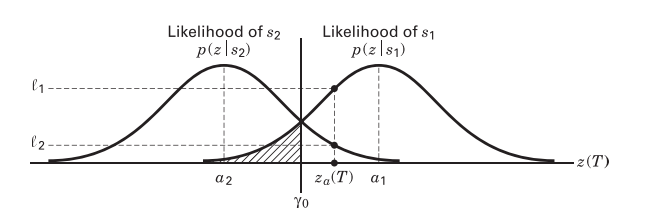

The theory for this lab is covered in the textbook "Digital Communications: Fundamentals and Applications", 2nd edition, by Bernard Sklar [1]. The text section numbers referenced below are from it.

## 1.1 GLFSR data source

_From text section 12.2.2. and handwritten notes pp. 29 and 33_ In order to generate a random sequence of bits of testing a data link, it is convenient to have a random data source with an equal number of logic 1s and 0s, or an equal number of positive and negative pulses. This can be achieved with a so-called linear feedback shift register (LFSR).

    
  __*Linear feedback shift register*__

At each time step (symbol time) $$T$$, the input on the left is determined by the XOR gate output and all the bits slide along one step and the output is the bit on the right. If the feedback shift register is of length $$M$$ and the feedback taps (XOR gates) are selected correctly, the output sequence will have length $$2^M -1$$ before it repeats.

## 1.2 Bit errors

_From text sections 3.1.3 and 3.2.1. and handwritten notes pp 33-43_ For a digital communications link between two points, the performance is characterized by the probability of a bit error. The probability is calculated based on the probability density functions in the figure below.

   
  __* Overlapping conditional probability density functions (text fig. 3.2) [1]*__

For each bit $$a_1$$ or $$a_2$$ there is some probability in the tail of these gaussian distrubutions that the wrong signal is received. This area under the tail of a gaussian PDF (probability density function) is characterized by the Q-function (a.k.a. gaussian survival function, a.k.a. complementary error function, a.k.a. co-error function). See text section 3.2.1 for more on this, and text equation 3.4.4 for more on the Q-function.

The probability of receiving bit $$a_1$$ is the area under the right curve and is described by

$$
P_B=Q\left( \frac{a_1 - a_2}{2\sigma_0} \right), \text{(text eqn. 3.42)},
$$

where $$Q()$$ is the Q-function. The point at which the curves overlap is the point at which the bit is no longer defined, at $$P_B=0.5$$.

## 1.3 Theory summary

1. Linear shift registers are a tool to generate pseudo-random binary sequences.
2. When assessing communications systems, the probability of receiving a bit as transmitted is a key metric. 

## References

[1] Sklar, B., & Ray, P. K. (2013). Digital Communications: Fundamentals and Applications (2nd ed.). Pearson. https://doi.org/10.1201/9781420049763.ch70