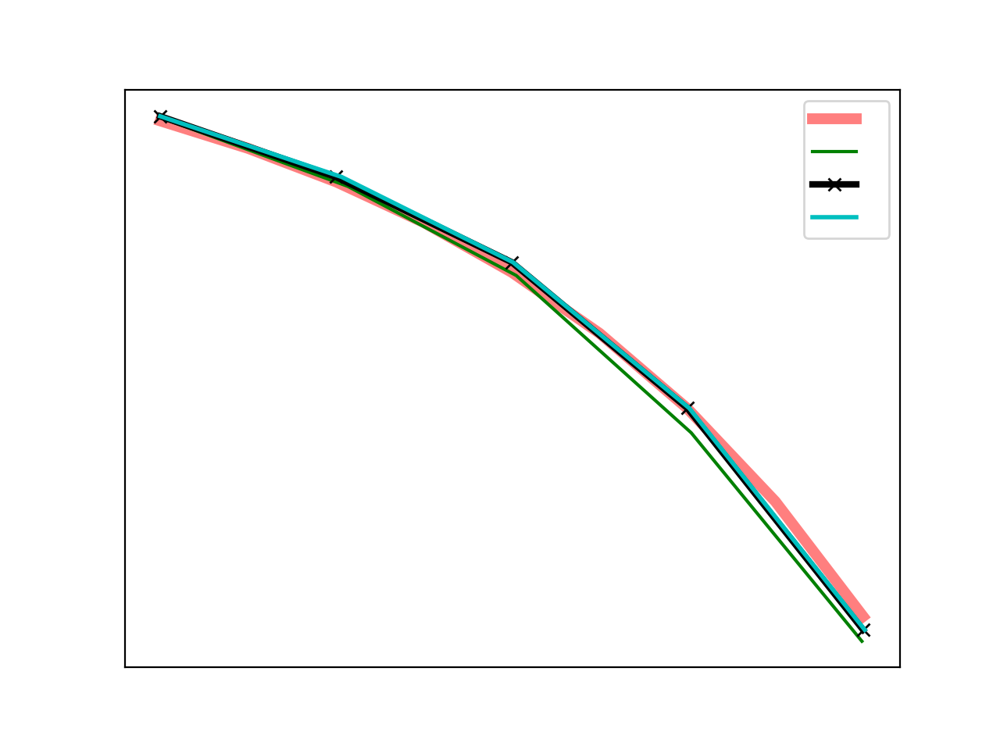

## Objectives

You will use the values recorded to plot a $$BER-\frac{E_b}{N_0}$$ curve for each pulse shape and then compare it with theory.

---

## Part 5 deliverables

For this section, the deliverables are:

- the answer to three deliverable questions,
- the code used to generate the BER curve (with the dataset hard coded into it),
- the resulting BER curve as a .PNG image file.

---

## Generating a BER curve

Using the values collected throughout this lab you can now generate a $$BER-\frac{E_b}{N_0}$$ curve.

You can use a programming language of your choice, but python or matlab have some handy tools for this job built in.

Plot four curves on the same axes:

1. BER curve for the theoretical $$BER=\sqrt{2\frac{E_b}{N_0}}$$,
2. BER curve using the collected BER values and calculated Eb/N0 values (using the output signal and noise powers) for the LPF flowgraph,
3. BER curve using the collected BER and Eb/N0 values for the matched filter flowgraph,
4. BER curve using the collected BER values and calculated Eb/N0 using the collected signal and noise powers at the output of the matched filter.

### 1. Theory curve

For generating a simulated curve of the theoretical $$BER-\frac{E_b}{N_0}$$ review [the theory section]({{ site.baseurl }}) of this lab. For the Q-function, Matlab ships with [`qfunc()`](https://www.mathworks.com/help/comm/ref/qfunc.html) while python has [`norm.sf()`](https://docs.scipy.org/doc/scipy-0.19.1/reference/generated/scipy.stats.norm.html) included in the scipy package.

### 2. LPF curve

Remember back to the derivation for $$\sigma$$ done [previously in this lab]({{ site.baseurl }}), 

$$
\frac{E_b}{N_0}=\frac{1}{2}\frac{a_i^2}{\sigma_0^2}, \text{(all in linear terms)}
$$

Use the signal power and noise powers measured at the output of the matched filter to calculate Eb/N0 values to match the collected BER values.

The BER values collected from the number sink are log10(BER). So to obtain the BER you will need to raise your collected values, -X by realizing that $$BER = 10^{-X}$$.

### 3. RRC curve with user-set Eb/N0 values

You collected a dataset of BER values for Eb/N0 values of 0, 2, 4, 6, 8 dB. Plot them against eachother (remembering that $$BER=10^{-X}$$).

### 3. RRC curve with calculated Eb/N0 values

Same method as for [the LPF curve](#2-lpf-curve).

### Plotting details

Now that you have the four curves, ensure that the plot has:

- a log scale on the y-axis
- a linear scale on the x-axis
- appropriate axes titles
- a legend (one entry for each of: "Theory", "LPF", "RRC set Eb/N0", "RRC calculated Eb/N0")

A sample of what the plot might look like is included below (with all the labelling elements removed).

   
  __*Sample BER curve*__







Review the [section deliverables](#part-4-deliverables) beforing moving on.
