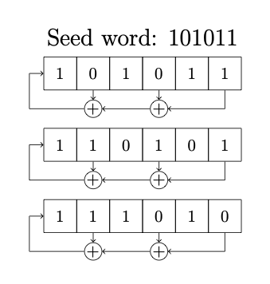
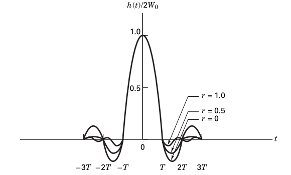
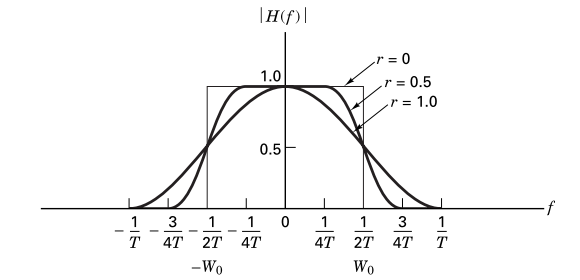
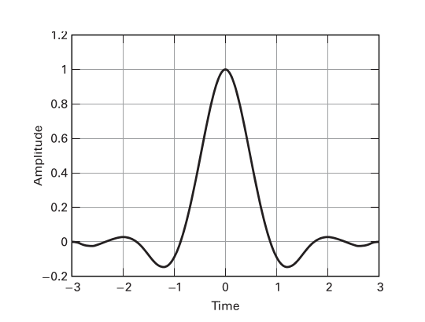
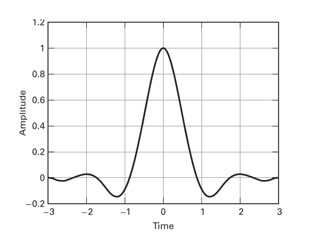

The theory for this lab is covered in the textbook "Digital Communications: Fundamentals and Applications", 2nd edition, by Bernard Sklar [1]. The text section numbers referenced below are from it.

## 1.1 GLFSR data source

_From text section 12.2.2._ In order to practice pulse-shaping, it is convenient to have a random data source, with an equal number of logic 1s and 0s, or an equal number of positive and negative pulses. This can be achieved with a so-called linear feedback shift register (LFSR).

    
  __*Linear feedback shift register*__

At each time step (symbol time) $$T$$, the input on the left is determined by the XOR gate output and all the bits slide along one step and the output is the bit on the right. If the feedback shift register is of length $$M$$ and the feedback taps (XOR gates) are selected correctly, the output sequence will have length $$2^M -1$$ before it repeats.

For more information on this refer to Dr. Driessen's handwritten notes (pp. 29 and 33).

## 1.2 Creating a waveform from a bitstream

_From text section 1.2.5._ Given a bitstream input, a sampling frequency $$f_s$$ and symbol time $$T$$, there must be $$f_sT$$ samples per symbol in the waveform to be transmitted. This can be:

- in the case of a square pulse, $$f_sT$$ samples of identical value,
- or in the case of an impulse, one sample at $$\pm 1$$ followed by $$f_sT-1$$ samples set to 0.

In either case the output consists of each input bit having a symbol that takes time $$T$$ to transmit, is made up of $$f_sT$$ samples and is running at sampling frequency $$f_s$$. A sequence of these symbols make up a waveform.
<!-- 
Given a square pulse shape, for a sampling frequency $$f_s$$ and symbol time $$T$$ , there are $$f_sT$$ samples per symbol. Each square pulse contains $$f_sT$$ samples of identical value. The data symbols, $$A_k = \pm 1$$ are represented by one sample per symbol and come from the data source at a rate $$\frac{1}{T}$$ symbols per second. To generate the square pulse, each sample of data must be repeated $$f_sT$$ times, so that the square pulse is represented by $$f_sT$$ samples running at sampling frequency $$f_s$$ to make up a symbol that takes time $$T$$ to transmit. A sequency of these symbols make up a waveform. -->



## 1.3 Pulse shaping

_From text sections 1.1.2, 3.3.1._ When transmitting a signal, there are two reasons to pulse shape the squares or impulses of the newly interpolated or repeated bitstream:

- to contain the transmission bandwidth within some desired spectral region (text section 1.1.2),
- reduce ISI (inter-symbol-interference) (text section 3.3.1).

Consider the data sequence from above represented by the sequence of impulses. This sequence can then be shaped by convolving it with a pulse shaping window of impulse response $$p(t)$$ and frequency response $$P(f)$$. _This is the exact operation done when FIR filtering_.

The filter coefficients of the FIR filter will be the pulse shape, $$p(t)$$ sampled at $$f_s$$. $$p(t)$$ can be any shape such as the options described below.

### 1.3.1 Using a LPF

In order to smooth the waveform a low pass filter with some pulse shaping window like a Hamming window can be used.

For the Nyquist criterion to be satisfied, the highest frequency in the datastream is $$\frac{f_s}{2} = \frac{1}{2T}$$. It follows that a square pulse or impulse can be low pass filtered at this frequency and retain all of the information in the binary data sequence which will be received/transmitted at that sampling frequency.

### 1.3.2 Using a Raised Cosine (RC) filter

_From text sections 3.3.1.2._ Pulse shaping windows can also be longer than the symbol length, for example a raised cosine pulse:

$$\begin{eqnarray}
    p(t)=
    \begin{cases}
      \frac{\pi}{4T}sinc\left( \frac{1}{2r} \right), & t = \pm \frac{T}{2r} \\
      \frac{1}{T}sinc\left( \frac{t}{T} \right)\frac{cos\left( \frac{\pi rt}{T}\right)}{1-\left( \frac{2rt}{T} \right)^2}, & \text{otherwise}
    \end{cases}
    , \text{(equivalent to text eqn. 3.79)}
\end{eqnarray}$$

where $$r$$ is the roll-off factor (a measure of bandwidth beyond the Nyquist bandwidth $$\frac{1}{2T}$$). The impulse (left) and frequency (right) responses of an RC filter are below. The impulse response is a sinc shape extending for a time usually truncated to $$6T$$ as shown.

   
  __*Raised cosine impulse (left) and frequency (right) responses for various roll-off values, $$r$$ (text fig. 3.17) [1].*__

The RC filter is ideal in that at sampling times $$nT~\forall~n~\in~\mathbb{Z}$$, it is zero-ISI. This can be seen in the figure above. At the first symbol time, the value is 1, and for all others the value is 0.

### 1.3.3 Using a Root Raised Cosine (RRC) filter

_From text section 3.3.3.2._ A receiver is optimum if the receiver filter matches the transmit filter. Thus we often use a Root Raised Cosine (RRC) pulse shaping filter at the transmitter and another RRC filter at the receiver, so that the combination of the two filters yields a Raised Cosine (RC) pulse shape at the receiver output. The RRC filter impulse response looks similar to the RC impulse response but with lower sidelobes.

With a suitable low pass filter or RRC filter, the received data at sampling times $$ t=kT + \epsilon $$ is $$A_k \pm 1$$ (real) where $$\epsilon$$ is adjusted to sample in the middle of the pulse $$p(t)$$. $$\epsilon$$ is a timing offset to sample the data away from the transitions between different bits. This timing offset can be fixed manually. In practical systems, a timing recovery circuit is used to determine the timing offset automatically.

The figure below shows the impulse response of a raised cosine pulse shape next to a root-raised cosine pulse shape. Notice that the RC filter decays faster, and that while it has zero-ISI, the RRC filter _does not exhibit zero-ISI_ (it does not cross zero at symbol times). If an RRC filter is used at the transmitter as well as the receiver, the product of their transfer functions is a zero-ISI RC shape.

   
  __*Raised cosine impulse response (left) and Root-raised cosine impulse response (right) for $$r=0.5$$ (text fig. 3.22) [1].*__

## 1.4 BER curves

_From text sections 3.1.4 and 3.1.5._ Is is standard to measure the performance of channels and modulation techniques using a $$BER-\frac{E_b}{N_0}$$ curve. This is closely related to the $$BER-SNR$$ curve as

$$
\frac{E_b}{N_0} = SNR\frac{W}{R}, \text{(text eqn. 3.30)},
$$

where $$SNR=\frac{S}{N}$$ (the signal to noise ratio), $$W$$ is the channel bandwidth and $$R$$ is the bit rate (all terms in the equation are linear). Hence $$\frac{E_b}{N_0}$$ is the signal to noise ratio normalized to the channel and the symbol rate. This can be intuitively understood when reorganized as $$SNR = \frac{E_b}{N_0}\frac{R}{W}$$ since the numerator is the total power of the received signal (energy-per-bit multiplied with the bit rate) while the denominator is the total noise power in the channel (noise power in 1 Hz multiplied with the number of Hz in the channel).

It is shown in the text section 3.2.2 that for a binary signal in a gaussian noise channel, this can be further simplified to $$SNR_{MAX} = \frac{2E_b}{N_0}$$ (text eqn. 3.52).

We are interested in this because we want to know the probability of receiving the correct bit. Consider the following figure,

   
  __* Overlapping conditional probability density functions (text fig. 3.2) [1]*__

At the entire symbol duration from $$a_1$$ to $$a_2$$ there is some probability in the tail of these gaussian distrubutions that the wrong signal is received. This area under the tail of a gaussian PDF (probability density function) is characterized by the Q-function (a.k.a. gaussian survival function, a.k.a. complementary error function, a.k.a. co-error function). See text section 3.2.1 for more on this, and text equation 3.4.4 for more on the Q-function.

For BPSK the function relating BER with SNR is,

$$
BER = Q\left( \sqrt{2\frac{E_b}{N_0}} \right) \text{all linear terms}
$$

where $$Q$$ is the Q-function.

## 1.5 Theory summary

Pulse shaping can be done in multiple ways. Above, three methods are considered:

1. Generate a pulse stream from a bit stream and LPF using a window that minimizes spectral leakage.
2. Generate a pulse stream from a bit stream and filter using a window that has a zero-ISI characteristic.
3. Generate a pulse stream from a bit stream and filter using a window that has a zero-ISI characteristic when used at both the receiver and the transmitter.

During this lab you will experiment with the first and third options.

BER can be calculated by measuring the SNR of a BPSK signal.

## References

[1] Sklar, B., & Ray, P. K. (2013). Digital Communications: Fundamentals and Applications (2nd ed.). Pearson. https://doi.org/10.1201/9781420049763.ch70